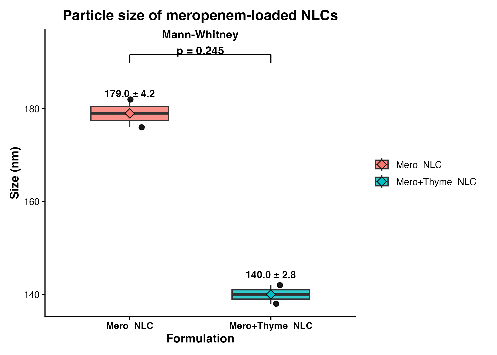

# Supplementary Information

## Particle Size Analysis of Meropenem-Loaded Nanostructured Lipid Carriers

### Overview
This Supplementary Information describes the statistical analysis and figure-generation workflow used to evaluate particle size distributions of meropenem-loaded nanostructured lipid carriers (NLCs), including formulations incorporating thyme oil. All analyses were performed using a fully reproducible computational pipeline implemented in R.

---

## Data and Experimental Groups
Particle size measurements were obtained for two experimental formulations:

- **Mero_NLC**: meropenem-loaded nanostructured lipid carriers  
- **Mero+Thyme_NLC**: meropenem-loaded nanostructured lipid carriers incorporating thyme oil  

The input dataset (`nlc_data.csv`) consisted of formulation identifiers and corresponding particle size values expressed in nanometres (nm). Sample sizes (*n*) correspond to the number of independent particle size measurements obtained for each formulation.

---

## Statistical Analysis
All statistical analyses were conducted using **R (version ≥ 4.1)**. Particle size data were summarised as **mean ± standard deviation (SD)** for each formulation. Data distributions were visualised using boxplots with individual measurements overlaid.

Normality of particle size distributions was assessed using the **Shapiro–Wilk test** when the number of observations per group was ≥ 3. Based on the outcome of the normality assessment, inter-group comparisons were performed as follows:

- An **unpaired two-tailed Student’s *t*-test** was used when both groups exhibited normal distributions.  
- The **Mann–Whitney U test** was applied when data deviated from normality.

Statistical significance was evaluated at a **two-sided α level of 0.05**.

---

## Figure Generation and Visualisation
Publication-ready figures were generated using custom R scripts. Boxplots display the median and interquartile range, with individual data points overlaid to illustrate data dispersion. The group mean is indicated on each boxplot, and **mean ± SD values** are annotated directly on the figure. Statistical comparisons between formulations are presented using a bracket with the corresponding *p*-value.

## Software and Packages
All analyses and visualisations were performed using the following R packages:

- `ggplot2`  
- `dplyr`  
- `readr`  
- `forcats`  

Custom scripts were used to ensure full reproducibility of statistical analyses and figure generation.

---

## Supplementary Figure
**Supplementary Figure S1. Particle size of meropenem-loaded nanostructured lipid carriers (NLCs).**  
Boxplots show particle size distributions for Mero_NLC and Mero+Thyme_NLC formulations, with individual measurements overlaid. Values are presented as mean ± SD. Statistical comparison between groups was performed using the Mann–Whitney U test (*p* = 0.245).

Boxplots show the distribution of particle size measurements for meropenem-loaded NLCs without (Mero_NLC) and with thyme oil incorporation (Mero+Thyme_NLC). Individual data points represent independent particle size measurements (nm). The central line indicates the median, boxes represent the interquartile range, and whiskers denote data dispersion. Mean particle size values ± standard deviation (SD) are annotated above each group. Statistical comparison between formulations was performed using the Mann–Whitney U test, with no significant difference observed between groups (p = 0.245).
---

## Code Availability
All data processing, statistical analysis, and figure-generation scripts are available in the following GitHub repository:

https://github.com/Draliahmad/NLC_Thyme_Meropenem

---

## Supplementary Outputs
The following supplementary files were generated as part of the analysis:

- `figures/particle_size_boxplot_stats.png`  
- `figures/particle_size_boxplot_stats.pdf`  
- `outputs/summary_stats_particle_size.csv`  
- `outputs/group_comparison_particle_size.csv`  
Dr Ali Ahmad, MBBS, MSc (CMM), MSc (DDD)
