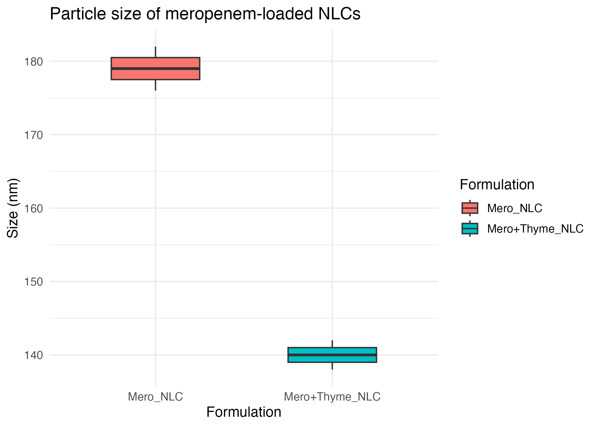

# NLC_Thyme_Meropenem

Statistical analysis of thyme oil–modified meropenem-loaded nanostructured lipid carriers (NLCs).

---

## Methods

- Data analysis performed in **R (v4.5.1)** using tidyverse-based workflows.
- Particle size distributions were visualised using boxplots.
- Statistical inference:
  - Independent two-sample *t*-test
  - Effect size estimation (Cohen’s *d*)

---

## Figure



---

## Outputs

- `figures/particle_size_boxplot.png`  
  Particle size distribution (boxplot).

- `outputs/summary_stats.csv`  
  Descriptive statistics per formulation (n, mean, SD, SE).

- `outputs/final_statistical_results.csv`  
  Final results including group means, mean difference, *t*-test *p*-value, and Cohen’s *d*.

---

## Statistical Testing

The script `scripts/02_stats.R` performs:

- Two-sample *t*-test: `t.test(Size_nm ~ Formulation)`
- Cohen’s *d* (pooled SD)

Results are saved to:

- `outputs/final_statistical_results.csv`

---

## How to Reproduce

```r
source("scripts/01_analysis.R")
source("scripts/02_stats.R")
